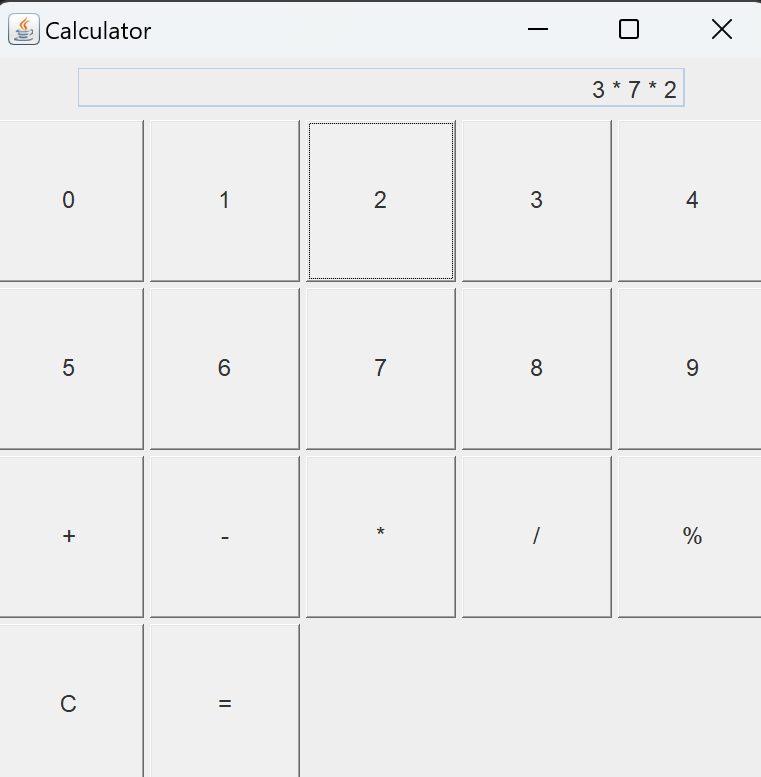
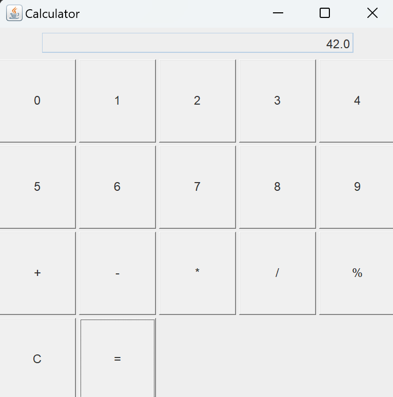

# Java Calculator Project

## Introduction

This project is a simple calculator application built using Java Swing. It allows users to perform basic arithmetic operations such as addition, subtraction, multiplication, division, and modulus. The calculator is designed with a graphical user interface (GUI) that makes it easy for users to input numbers and operations, and view the results in real time.

## Description

The Java Calculator is implemented using the `JFrame` class from the Swing library, which provides the basic window structure for the application. The calculator supports multiple operations in a sequence, allowing users to perform continuous calculations without needing to reset after each operation.

### Key Features:
- **Basic Arithmetic Operations**: Supports addition, subtraction, multiplication, division, and modulus.
- **Chained Calculations**: Users can perform multiple operations in sequence, with the result of each operation carried forward.
- **Clear Functionality**: Provides a clear button to reset the calculator at any time.
- **Error Handling**: Includes basic error handling for division by zero, displaying an appropriate error message.

## Explanation

The application is structured around a simple event-driven model, where user inputs trigger events that are handled by the `actionPerformed` method. The calculator uses a text field to display the current input or result and buttons to represent digits and operations.

### Components:

- **TextField (`T1`)**: Displays the current input and the result of operations.
- **Buttons**: 
  - **Number Buttons (`NumButtons[]`)**: For digit input (0-9).
  - **Operation Buttons**: For selecting the desired arithmetic operation (`+`, `-`, `*`, `/`, `%`).
  - **Clear Button (`clear`)**: Resets the calculator.
  - **Equal Button (`EQ`)**: Computes the result based on the entered inputs and selected operation.

### Calculation Logic:
- **Input Handling**: The calculator accumulates the user's input as a string, which is converted to a float for arithmetic operations.
- **Operation Execution**: Upon selecting an operation (e.g., `+`, `-`), the calculator processes the current input and stores the result, ready for the next input.
- **Result Handling**: When the equal button (`=`) is pressed, the final result of the operations is displayed.

The project is structured to allow multiple operations in a sequence, such as `5 + 3 * 2`, which will yield the correct result by applying the operations in the order they are input.

## Conclusion

This Java Calculator project serves as a practical example of building a GUI application using Java Swing. It demonstrates the principles of event-driven programming and provides a foundation for more complex applications. The calculator is user-friendly, handles basic arithmetic operations efficiently, and is a valuable tool for anyone looking to understand GUI development in Java.

## Output

